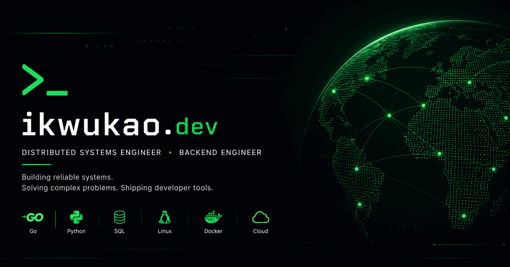

# ikwukao.dev



**Personal engineering portfolio and technical journal focused on backend engineering, distributed systems, platform engineering, and cloud-native infrastructure.**

[](https://gohugo.io/)
[](https://tailwindcss.com/)
[](https://app.netlify.com/projects/ikwukao/deploys)
[](LICENSE)

**Live site:** [https://ikwukao.dev/](https://ikwukao.dev/)

---

## Overview

**ikwukao.dev** is my personal portfolio and engineering journal, built to document projects, technical work, and lessons learned while building reliable software systems.

The site prioritizes performance, accessibility, simplicity, and maintainability.

---

## Motivation

The project exists to:

* Showcase backend and distributed-systems engineering work.
* Document practical engineering through technical writing.
* Present projects across Go, Python, DevOps, and cloud-native technologies.
* Maintain a fast, accessible, and production-oriented personal web presence.

---

## Features

* Hugo-powered static site
* Responsive, terminal-inspired design
* Dark-first interface
* Markdown-based content
* Technical engineering journal
* Project portfolio
* Contact and professional information
* SEO and Open Graph metadata
* RSS and JSON feeds
* Automated deployment

---

## Technology Stack

| Category              | Technologies    |
| --------------------- | --------------- |
| Static Site Generator | Hugo            |
| Styling               | Tailwind CSS v4 |
| Content               | Markdown        |
| Deployment            | Netlify         |
| Automation            | GitHub Actions  |
| Version Control       | Git & GitHub    |

---

## Project Structure

```text
.
├── assets/
├── content/
├── layouts/
├── static/
├── themes/
├── .github/
├── hugo.toml
├── package.json
└── README.md
```

---

## Quick Start

### Prerequisites

* Hugo (Extended)
* Node.js 20+
* npm
* Git

### Clone the repository

```bash
git clone https://github.com/ikwukao/ikwukao.dev.git
cd ikwukao.dev
```

### Install dependencies

```bash
npm install
```

### Start the development server

```bash
hugo server
```

The site will be available at:

```text
http://localhost:1313
```

---

## Usage

### Build the production site

```bash
hugo
```

### Clean generated files

```bash
rm -rf public resources
```

### Preview production output

```bash
hugo server --environment production
```

---

## Design Principles

This project follows a few guiding principles:

* Performance over complexity
* Simplicity over visual noise
* Accessibility by default
* Mobile-first development
* Clean, maintainable architecture
* Technical honesty
* Documentation-first engineering

---

## Contributing

Contributions, suggestions, and constructive feedback are welcome.

If you'd like to improve the project:

1. Fork the repository.
2. Create a feature branch.
3. Commit your changes using meaningful commit messages.
4. Open a pull request describing your changes.

Please ensure any contribution aligns with the project's goals of performance, maintainability, and high engineering quality.

---

## License

This project is licensed under the MIT License. See the [LICENSE](LICENSE) file for details.

---

## Connect

* **Website**: [https://ikwukao.dev](https://ikwukao.dev)
* **GitHub**: [https://github.com/ikwukao](https://github.com/ikwukao)
* **X**: [https://x.com/ikwukao_](https://x.com/ikwukao_)

---

**Built with ❤️. Focused on reliable backend systems, distributed platforms, and cloud-native infrastructure.**

---
